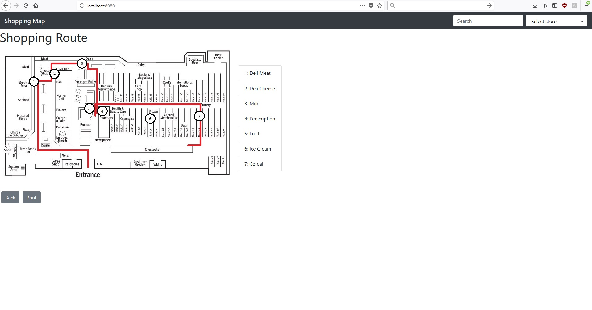
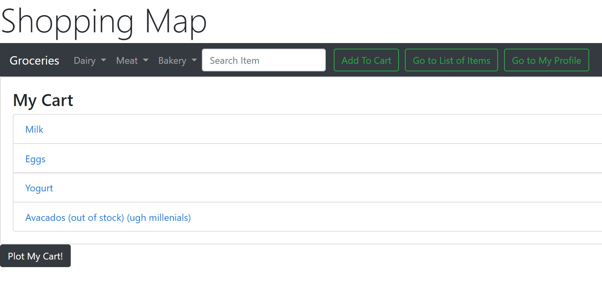
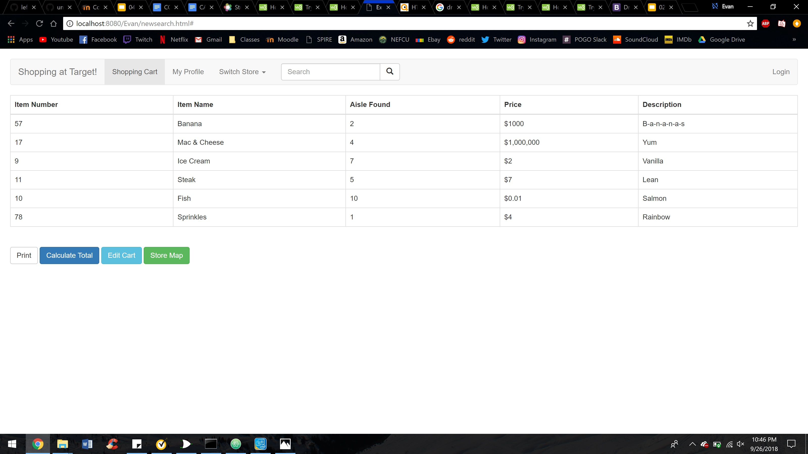
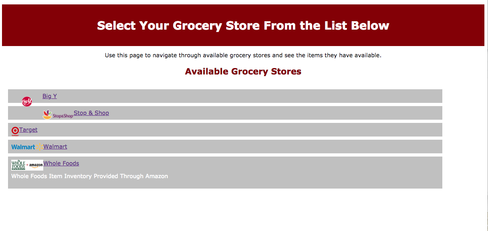
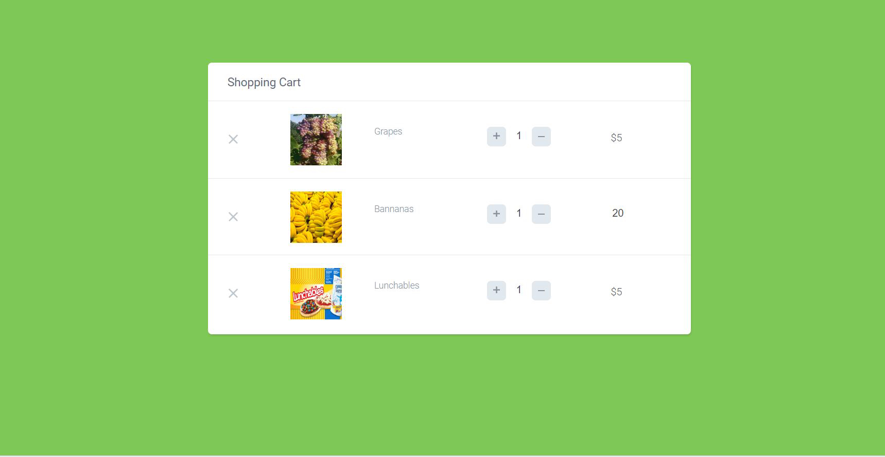

# Team Leftover5

# Shopping Map

# Team Overview

* Mina Bruso, minaalexandra96
* Harold Rubio, haroldrubio
* Harmon Lau, hungrygiraffe
* Kiyanna Sully, leftover5-ksully
* Evan Geremia, egeremia

# Innovative Idea

Why doesn't there already exist an app that plots the most efficient route for picking up items on your shopping list?? With this handy dandy Shopping Map (tentative title) you'll never run back and forth across the grocery store again. It's like Google Maps, but for stores. You can choose your store, add items to your list, and voila! It plots the fastest route for you within the grocery store so you don't have to suffer with all those other annoying shoppers. You can even save your favorite lists for all those weekly essential-item grocery runs. 

# Important Data

We'll have different stores to choose from, searchable items for those stores to add to your list, favorite shopping lists, store layouts to create the maps, and user accounts so people can save their preferences.

# User Interface

For now, we have multiple drafts of some ideas that we'd like to eventually culminate into one beautiful, user friendly interface. We know the gist of what we want - a search bar and categories for finding items for your shopping list, the list itself, a home menu for saving user data such as favorite lists, and of course the plotted map indicating where the items are on your route. We're thinking it might end up looking a bit like how many shopping carts add items to a cart, but our end result will be creating a map route to purchase them physically instead of checking out at a virtual register. 

