# Leftover5 - Down the Aisle - Fall 2018

# Overview of Application
Our application "Down the Aisle" effectively will allow users to login, select the store they want to make a shopping list for, be able to search for the items they want, put them into their cart, and finally generate a map showing where each item is and the fastest route to get it. What we implemented includes loading mock users that are able to login and view data related to that user as well as modifying data. For our application, we updated how some of the functionality of the search bar works and various other little changes to accommodate the implementation of user authentication and user interaction. Everything we outlined in the previous submission is still the same, including our intention of not fully implementing creating a user generated map.

# Team Members
* Mina Bruso, minaalexandra96
* Harold Rubio, haroldrubio
* Harmon Lau, hungrygiraffe
* Kiyanna Sully, leftover5-ksully
* Evan Geremia, egeremia

# User Interface
## Homepage - the glue that connected the application together
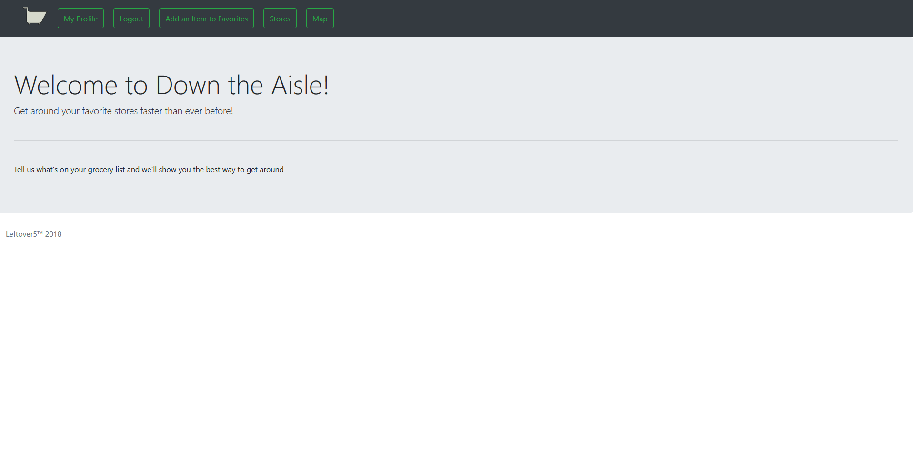

## Profile Page - has user settings and favorites
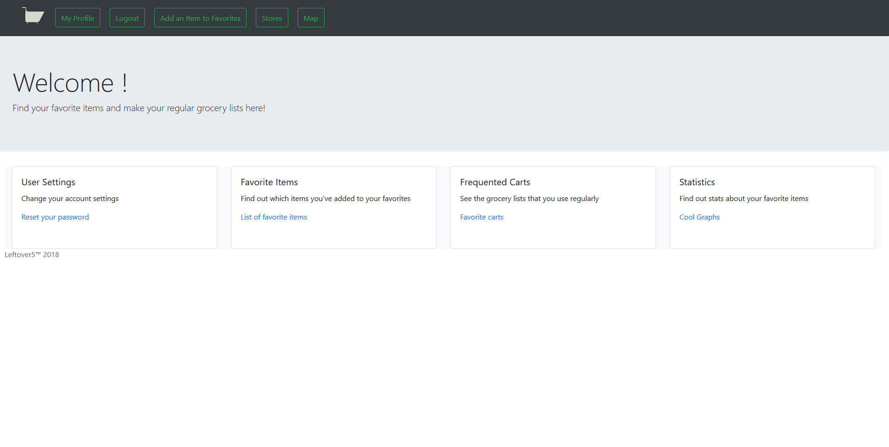

## User Preferences - contains password reset and other user settings
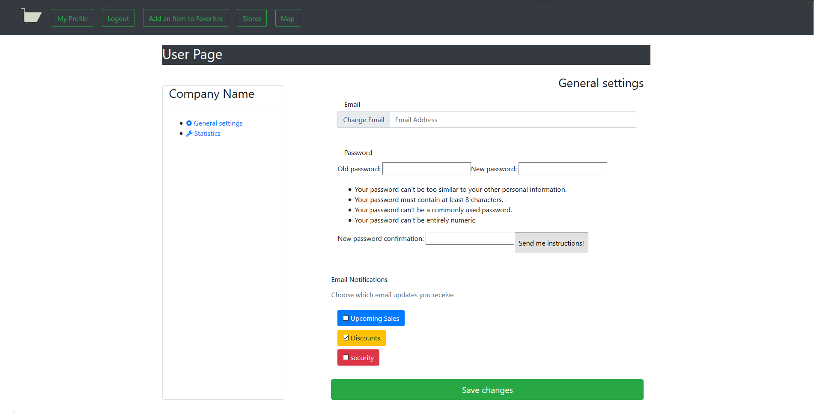

## Favorite Items - contains a user's favorite items
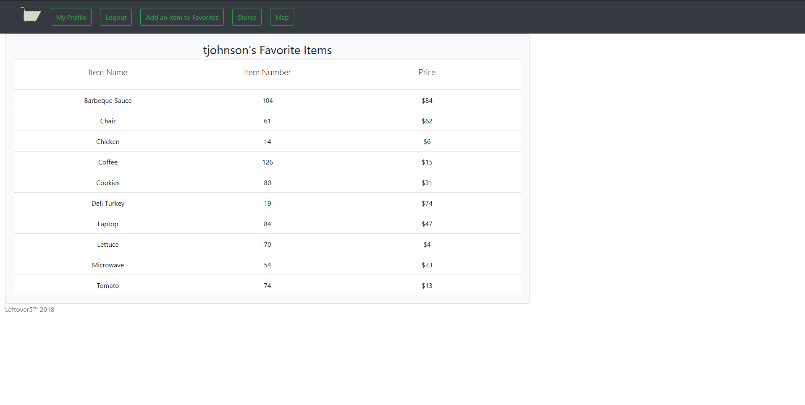

## Favorite Cart - contains a user's favorite cart
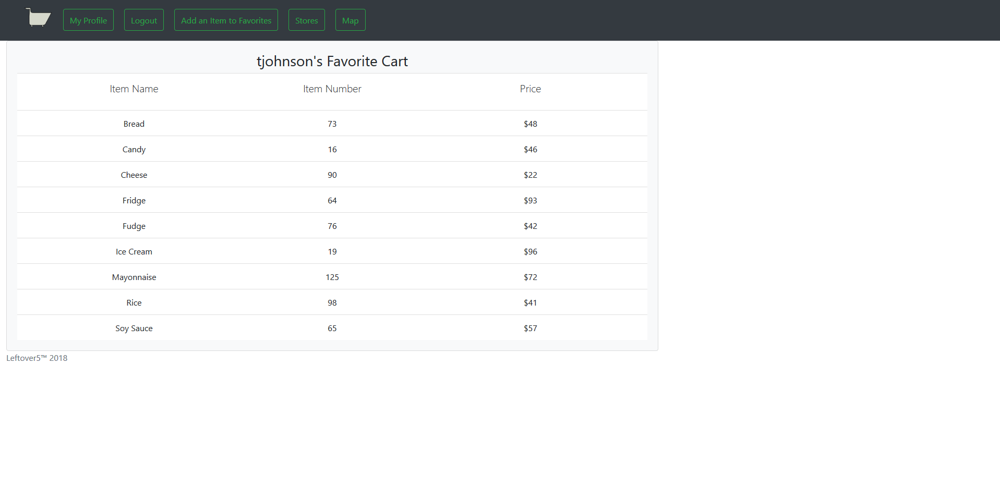

## Add Item to Favorites - allows a user with special permissions to add an item to their favorite items list
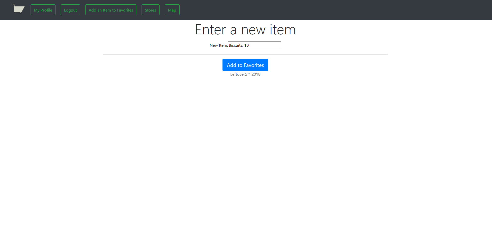

## Login Error - error page if permissions or login is required to view a page
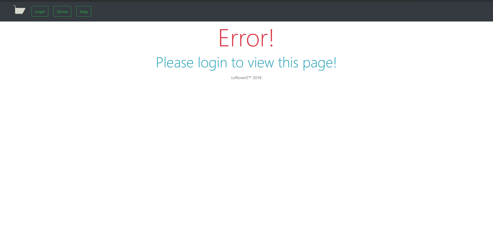

## Add Item Success - success page to let user know the item was actually added to their favorite items list
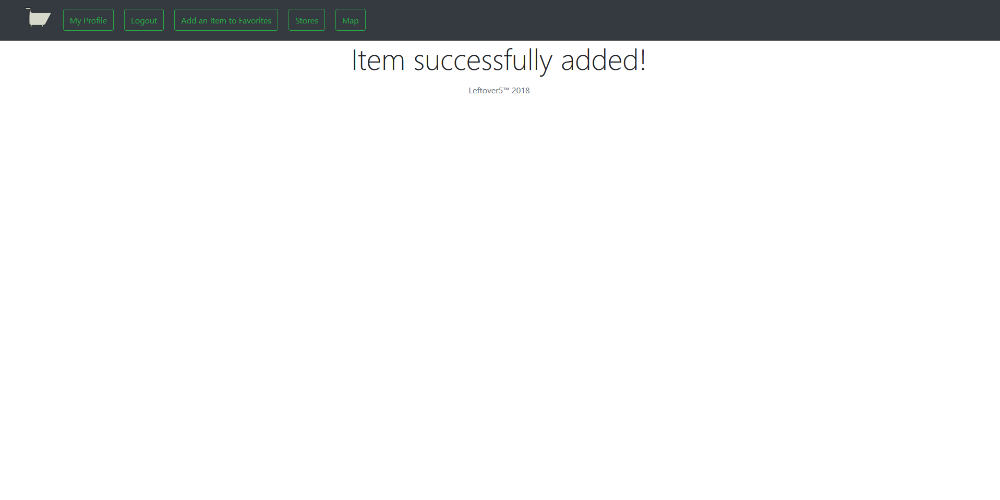

## Store Select - list of stores for user to shop from 
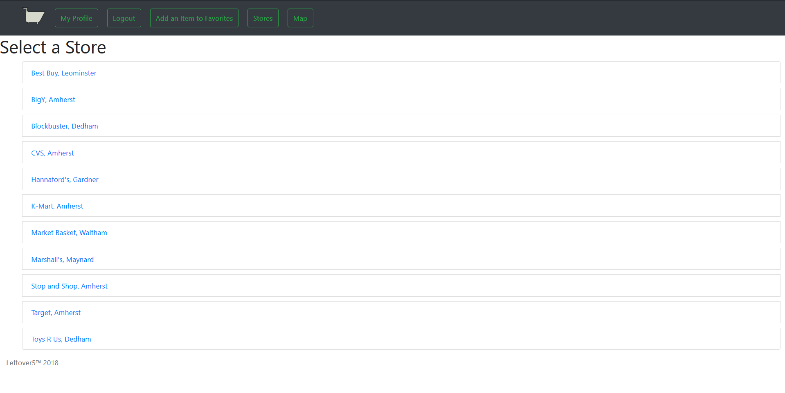

## Items / Cart - displays all items in store and cart so far
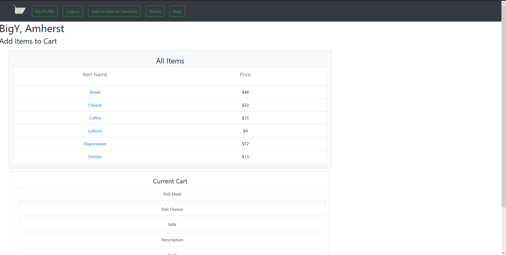

## Map - the main point of the app - displays the mapped route based on the user's cart
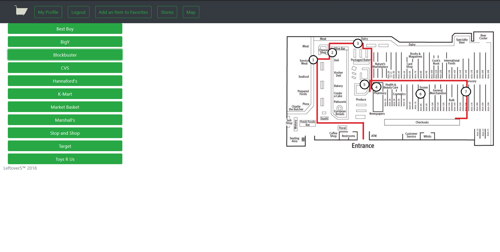

# Data Model
Store: A place for each item to be associated with and to store a geographic location

Item: Added attributes that would be important for our model, such as aisles and prices, but also ones that would help each store integrate their items into our models, such as item number

List: Testing out the ability to generically store many items without a many to many relation

User: A way to store a user's favorite preferences, with a one-to-one relation with Django's user for authentication. We want to the user to have many favorite items and these items can be associated with many users. However, we want each user to have a unique favorite cart to be associated with them.
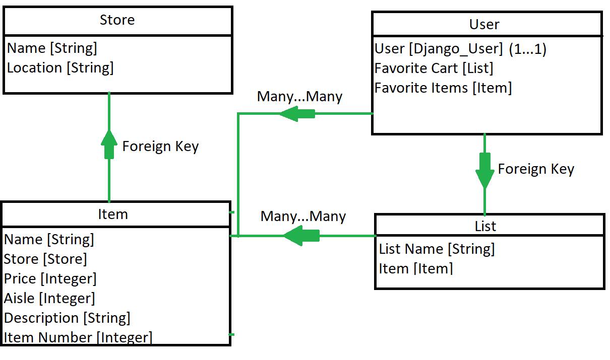

# URL Routes/Mappings
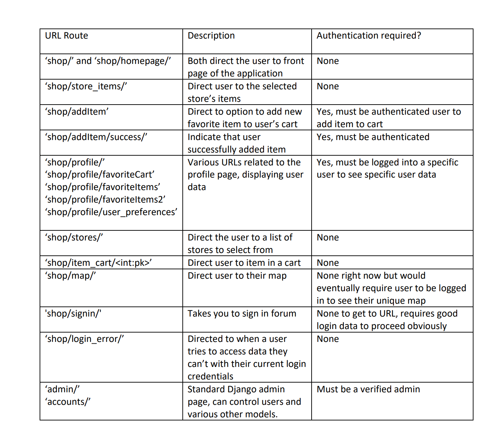

# Statistics

# Authentication/Authorization
Users login through the django login interface. Once they login, they have access to the Profile Page with user-specific settings and statistics. Only some users and the admin have permission to add an item to their favorite items list, as per the user-group requirement. When the init.sh is run, there will be sample users with passwords created to login.

# Team Choice
Our team choice was a password reset. There is a link to password reset/user preferences on the user profile page. 

# Conclusion
We learned a lot about general website design, such as starting out with mock UIs and planning out data models before moving on to coding the layout and finally functionality. It was nice to take what we learned in class and apply it to the project. Seeing it all come together was satisfying. The greatest challenge throughout the whole process was finding time to meetup, given our schedules with other classes and holiday breaks and such. In terms of technical difficulties, it seemed that on the whole we maybe had less experience with web programming than some other groups in the class, which was a bit of a challenge but we learned a lot during the process. Overall, we are all proud of the work we accomplished this semester.

